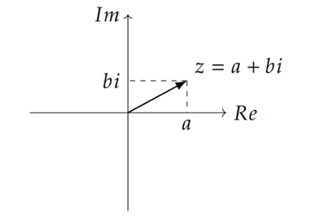
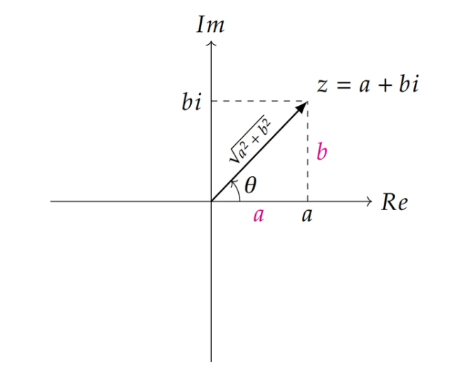
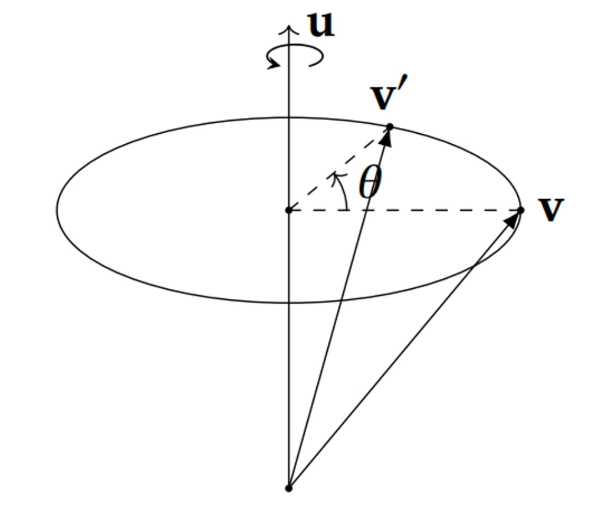
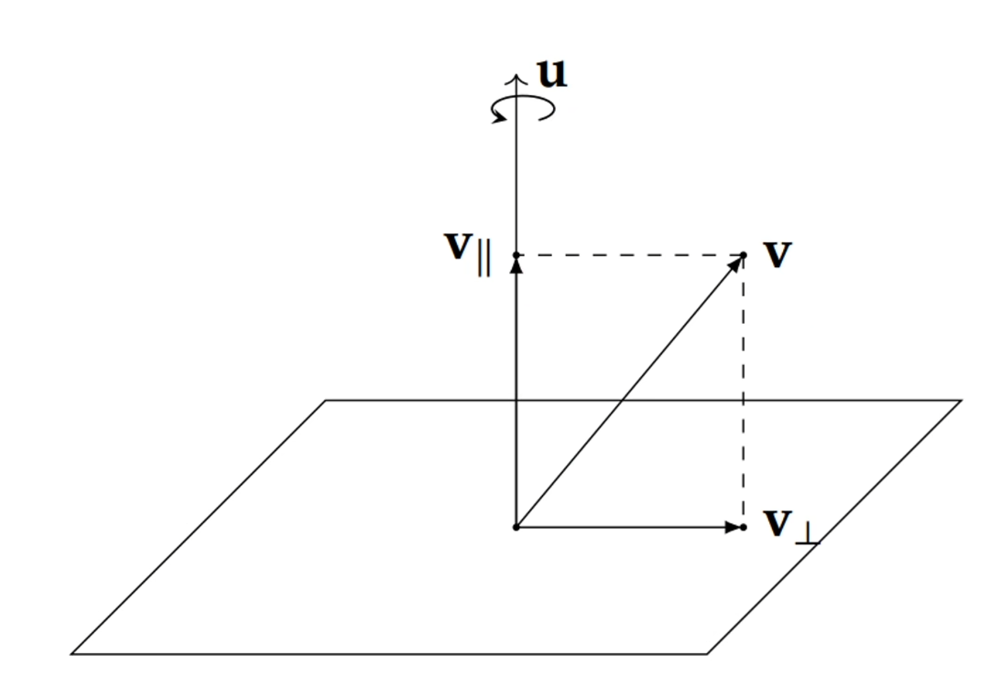
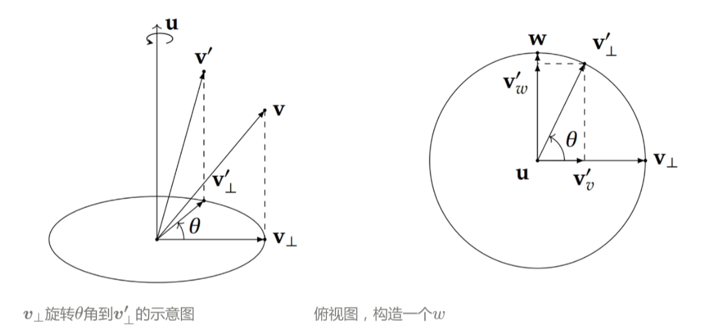

# 四元数 (Quaternion)

## 1.什么是四元数？

四元数是由数学家William Rowan Hamilton于1843年提出的一种数学工具，它将复数从二维推广到了四维空间。一个四元数由**一个实部**和**三个虚部**组成：

$$q = w + xi + yj + zk$$

其中 $i^2 = j^2 = k^2 = ijk = -1$，$w$ 是实部，$x, y, z$ 是虚部。在旋转表示中，通常写成：

$$q = [w, \mathbf{v}] = [w, x, y, z]$$

---

## 2.四元数的作用

四元数（Quaternion）在 SLAM 和机器人领域中主要用于表示三维旋转，是姿态（orientation）表达的核心工具之一。机器人的位姿通常表示为「平移 + 旋转」。旋转部分几乎都用四元数来参数化。

**在 SLAM 中的具体应用场景**

- **状态向量**：EKF-SLAM、图优化 SLAM 中，每个关键帧的旋转状态就是一个单位四元数。 
- **图优化**：在 g2o、Ceres 等优化框架中，位姿节点的旋转部分用四元数（或等价的李群 SO(3)）表达，优化时对其施加局部扰动来求解。
- **IMU 预积分**：视觉惯性 SLAM（如 VINS-Mono、ORB-SLAM3）中，IMU 的角速度积分直接用四元数微分方程来更新姿态。
- **传感器融合**：将来自不同传感器（相机、IMU、轮式里程计）的旋转统一到一个四元数表示下进行融合。

---

## 3. 复数与2D旋转

四元数的表示和计算十分复杂和晦涩，例如四元数为何是这样去表示**3D旋转**的？想要搞清楚四元数背后的原理，我们不妨先从理解**复数和2D旋转**开始下手：

### 复数表达

表达复数使用$z=a+bi$

其中$a,b∈\mathbb{R}, i^2=-1$

我们将a称为这个复数的实部(Real Part)，b称为这个复数的虚部(Imaginary Part)。

用向量来表示一个复数$z=\begin{bmatrix} a \\\ b \end{bmatrix}$

用矩阵来表示一个复数$z=\begin{bmatrix} a&-b \\\ b&a \end{bmatrix}$

点击展开：为什么可以这样写？

核心逻辑：i 的矩阵化身
复数最核心的定义是$i^2=-1$，假设我们要找一个矩阵M来代表i：

复数i对应矩阵形式就是$M=\begin{bmatrix} 0&-1 \\\ 1&0 \end{bmatrix}$（单位矩阵I逆时针旋转90度得到的结果）

那么对应的$z=a+bi=\begin{bmatrix} a&0 \\\ 0&a \end{bmatrix} + \begin{bmatrix} 0&-b \\\ b&0 \end{bmatrix} = \begin{bmatrix} a&-b \\\ b&a \end{bmatrix}$

### 模长与共轭

**复数的模长**：$||z||=\sqrt{a^2+b^2}$

**复数的共轭**：$\bar{z}=a-bi$

$z\bar{z} = (a+bi)(a-bi) = a^2 + b^2$

---

### 复数相乘与2D旋转

$\begin{bmatrix} a&-b \\\ b&a \end{bmatrix}=\sqrt{a^2 + b^2}\begin{bmatrix} \frac{a}{\sqrt{a^2 + b^2}}&\frac{-b}{\sqrt{a^2 + b^2}} \\\ \frac{b}{\sqrt{a^2 + b^2}}&\frac{a}{\sqrt{a^2 + b^2}} \end{bmatrix}$

根据三角函数可得：

$\begin{bmatrix} a&-b \\\ b&a \end{bmatrix}=\sqrt{a^2 + b^2}\begin{bmatrix} cos\theta&-sin\theta \\\ sin\theta&cos\theta\end{bmatrix}$

$\begin{bmatrix} a&-b \\\ b&a \end{bmatrix}=||z||\begin{bmatrix} cos\theta&-sin\theta \\\ sin\theta&cos\theta\end{bmatrix}$

$\begin{bmatrix} a&-b \\\ b&a \end{bmatrix}=\begin{bmatrix}||z||&0 \\\ 0&||z||\end{bmatrix} \begin{bmatrix} cos\theta&-sin\theta \\\ sin\theta&cos\theta\end{bmatrix}$

把左边视为缩放矩阵，右边为旋转矩阵

复数的相乘其实是旋转与缩放的复合

---

### 复数的极坐标型

欧拉公式(Euler's Formula)：$cos(\theta)+isin(\theta)=e^{i\theta}$

$z=||z||\begin{bmatrix} cos\theta&-sin\theta \\\ sin\theta&cos\theta\end{bmatrix}$

$z=||z||(cos(\theta)+isin(\theta))$

$z=||z||e^{i\theta}$

如果我们定义r=||z||，我们就得到了复数的极坐标形式：

$z=re^{i\theta}$

我们可以使用一个缩放因子r和旋转角度$\theta$的形式来定义任意一个复数，而且它旋转与缩放的性质仍然存在。

对空间2D向量旋转也就可以表示为：

$v\'=re^{i\theta}v$

---

## 4.轴角表示3D旋转

表示三维空间中旋转的方式有很多种，比如前面介绍过的欧拉角，但欧拉角可能会遇到万向节死锁的问题。

这里我们介绍另一种方式，**轴角**。

假设我们有一个经过原点的旋转轴$u=(x,y,z)^T$，我们把向量v，沿着旋转轴旋转θ度，变换到$v\'$(坐标系使用的都是右手坐标系)。

使用轴角，潜在是四个变量，旋转轴的(x,y,z)三个变量，以及一个旋转角θ。

实际上我们使用$u=(x,y,z)^T$，这里的**单位向量就是旋转的方向，模长就是旋转角**

### 旋转的分解

我们可以将v分解为平行于旋转轴u以及正交于u的两个分量

$\mathbf{v} = \mathbf{v}\_{\parallel} + \mathbf{v}_{\perp}$

根据正交投影的公式，我们可以得出：

$\mathbf{v}\_{\parallel}=\frac{u \cdot v}{u \cdot u}u=\frac{u \cdot v}{||u||^2}u=(u \cdot v)u$ 

因为$\mathbf{v}=\mathbf{v}\_{\parallel}+ \mathbf{v}_{\perp}=\mathbf{v}-(u \cdot \mathbf{v})u$

#### $\mathbf{v}\_{\parallel}$的旋转

可以看出来，$\mathbf{v}\_{\parallel}$因为与u重合，没有被旋转

所以$\mathbf{v\'}\_{\parallel}=\mathbf{v}\_{\parallel}$

#### $\mathbf{v}\_{\perp}$的旋转

我们构造一个同时正交于u和$\mathbf{v}\_{\perp}的向量\omega$

$\omega=u \times \mathbf{v}\_{\perp}$

可以发现这个新的向量$\omega$指向$\mathbf{v}\_{\perp}$逆时针旋转$\frac{\pi}{2}$后的方向，并且和$\mathbf{v}\_{\perp}$一样也处于正交于u的平面内。

$||\omega||=||u \times \mathbf{v}\_{\perp}||=||u|| \cdot \mathbf{v}\_{\perp} \cdot sin(\pi/2)=||\mathbf{v}\_{\perp}||$

所以\$\omega$和$\mathbf{v}\_{\perp}$的模长是相同的，$\omega$也位于圆上

我们让$\omega$和$\mathbf{v}\_{\perp}$构成一个新的直角坐标系，把$\mathbf{v\'}\_{\perp}$进行分解

$\mathbf{v\'}\_{\perp}=\mathbf{v\'_v}+\mathbf{v\'_w}=cos(\theta)\mathbf{v}\_{\perp}+sin(\theta)\omega=cos(\theta)\mathbf{v}\_{\perp}+sin(\theta)(u \times \mathbf{v}\_{\perp})$

**由此我们可以得到：**

$\mathbf{v\'}\_{\perp}=cos(\theta)\mathbf{v}\_{\perp}+sin(\theta)(u \times \mathbf{v}\_{\perp})$

### 罗德里格斯旋转公式Rodrigues' Rotation Formula

将上面两个结果组合就可以获得：

3D空间中任意一个$\mathbf{v\'}$沿着单位向量u旋转θ角度之后的$\mathbf{v\'}$为：

$$ \mathbf{v\'}= \mathbf{v}\cos\theta + (\mathbf{u} \times \mathbf{v})\sin\theta + \mathbf{u}(\mathbf{u} \cdot \mathbf{v})(1 - \cos\theta) $$
