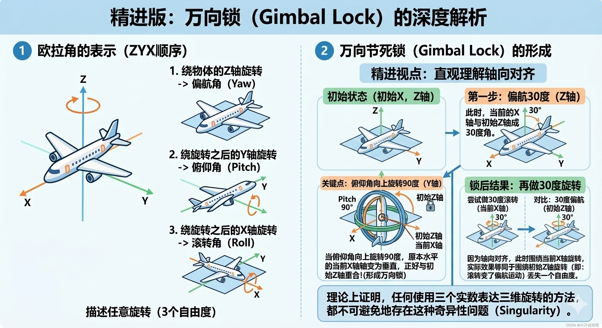

# 欧拉角 (Euler Angles)

### 🌟 什么是欧拉角？
想象你在指挥一架飞机：你想让它**向左转**（偏航）、**抬头爬升**（俯仰）、或者**侧身翻滚**（滚转）。这种通过三个简单的角度来描述物体在三维空间中“怎么摆”的方法，就是**欧拉角**。

### 🚀 它有什么用？
它是人类直觉最容易理解的旋转表达方式。
* **航空航天**：描述飞机、无人机的飞行姿态。
* **游戏开发**：调整角色视角（第一人称射击游戏中的上下左右看）。
* **人机交互**：你在手机上玩赛车游戏，倾斜手机控制转向，后台处理的就是欧拉角。

---

## 1. 欧拉角的表示方法

欧拉角的核心思想是：**任何复杂的旋转，都可以拆解为绕三个互相垂直的轴进行的连续旋转。**

在工程中，最常用的是 `ZYX` 顺序，也就是经典的 **“偏航-俯仰-滚转” (Yaw-Pitch-Roll)**。

假设一架飞机的初始状态：前方为 **X轴**，右侧为 **Y轴**，上方为 **Z轴**。
那么，任何旋转都可以看作是：
1.  **偏航角 (Yaw)**：绕物体的 `Z轴`（垂直轴）旋转，像汽车左右转弯。
2.  **俯仰角 (Pitch)**：绕旋转之后的 `Y轴`（横向轴）旋转，像飞机抬头或低头。
3.  **滚转角 (Roll)**：绕旋转之后的 `X轴`（纵轴）旋转，像飞机侧身侧翻。


> **注意**：由于旋转是有先后顺序的，先绕 X 再绕 Y，和先绕 Y 再绕 X，最后得到的结果是**完全不同**的。

---

## 2. 万向节死锁 (Gimbal Lock)：消失的自由度

虽然欧拉角很直观，但它有一个致命的数学缺陷——**万向锁**。
简单来说：**当俯仰角（Pitch）旋转到 ±90°（垂直向上或向下）时，系统会突然“弄丢”一个旋转维度。**

### 🔍 案例演示：为什么会“锁死”？
让我们分步追踪一架飞机的运动过程（参考下方图例）：

1.  **第一步：偏航 (Yaw)**
    飞机绕当前的 `Z轴` 逆时针旋转 30°。此时飞机在水平面上向左转了。
2.  **第二步：俯仰 (Pitch)**
    飞机绕当前的 `Y轴` 顺时针旋转 **90°**。
    * **关键点**：此时机头垂直指向天空。注意！飞机的纵轴（原本的 `X轴`）现在也变成了**垂直向上**。
3.  **第三步：滚转 (Roll)**
    飞机绕当前的 `X轴`（现在是垂直向上的）旋转 30°。

**真相大白：**
如果我们从飞机自身的坐标系(移动坐标系)去观察，这三次旋转确实是沿着飞机的三个互相垂直的坐标轴上进行了三次旋转，但是如果我们把视野拉远，从第三者的角度来看待这三次旋转(从世界坐标系来观察)，你会发现飞机的第一次和第三次旋转实际上是沿着同一个轴的(真实物理世界下)。

> **结论**：当俯仰角为 90° 时，`第一道轴(Z)` 和 `第三道轴(X)` 重合了。原本我们有三个轴可以独立旋转，现在变成了两个，我们丢失掉了一个自由度，这就是**奇异性问题**。

---

## 3. 为什么我们要避开它？

虽然欧拉角对人类很友好，但在机器人控制、自动驾驶（SLAM）和数学计算中，它有很多副作用：
* **计算困境**：当发生万向锁时，数学方程会出现“除以 0”的情况。
* **不适合插值**：如果你想平滑地让镜头从 A 点转到 B 点，用欧拉角直接计算往往会产生诡异的抖动。

**应用场景建议：**
* ✅ **人机交互**：在设置界面给用户看角度数值。
* ❌ **程序底层**：在滤波器（如 EKF）、图形渲染或优化算法中，我们通常改用 **四元数 (Quaternion)** 或 **旋转矩阵**。

---